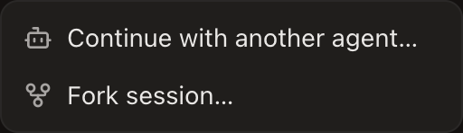

# Codex session fork verification

Verified in the desktop app over CDP on macOS with Codex 0.155.1, September 21, 2026. Mouse and keyboard input drove the flows; rollout metadata and terminal bindings supplied identity checks.

- A fresh Codex session launched with `--disable hooks` remained disabled before its first message. After its response created a rollout, opening the menu enabled Fork even though the terminal binding still had no hook-reported session ID.
- Native Fork opened a new tab with the source conversation. The child returned the exact marker from that conversation and used a different session ID.
- A source launched in a temporary `CODEX_HOME`, with hooks disabled, forked into that same home despite the configured default being elsewhere. Source and child rollout files had distinct IDs. The child returned the source's marker.
- Six switches between the custom-home source and child, and a trip to the workspace list and back, preserved enabled menu state. No application console errors were captured in that pass.
- Test tabs were closed and their bindings ended.

Focused tests cover actual process-tree isolation, ambiguous concurrent sessions, subagents, mismatched metadata, large instruction records, missing files, compressed rollout filenames, changed configuration, missing account provenance, and terminal reuse.

Discovery uses open files belonging to the terminal process tree on macOS and Linux. Linux, Windows, remote hosts, and an actual provider-account credential switch were not tested through CDP. A fresh session must first create its rollout. Authenticated launch-home snapshots are runtime state; if a host restart loses that snapshot, reopen the source session before forking. Shared rollout storage alone never selects an account home. Compressed rollout recognition was tested at preflight, not by running Codex against a compressed archive.
